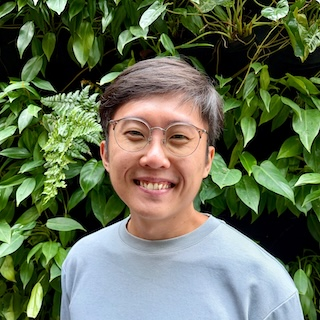

---js
const eleventyNavigation = {
	key: "About",
	order: 3
};
---
# About

I have been a Full-Stack Software Engineer since 2016 including professional tenure overseas, a Computer Engineering degree, and an AWS Certified Solutions Architect. Passionate about applying Domain-Driven Design principles to create simple user-centric applications. Brings System Design document writing to every project, demonstrating backend expertise in building scalable systems and enhancing visibility for all stakeholders. 

Currently seeking opportunities to specialise in high-concurrency and distributed systems, leveraging Go (Golang).

## Navigating this blog

Each post has a tag associated with it, and all tags can be seen [here](/tags).

As this is a technical blog, I have attached a Technical Level (_TL_) to each posts to guide the reader on how complex the current post can be.

| Technical Level | Description 
| ----- | -----
| _TL1_ | High level concepts that a common reader should be able to understand. 
| _TL2_ | Touches on implementation detail; may need a Computing / IT background to appreciate. 
| _TL3_ | Deep Dives into code to explain features or concepts. 
| _TL4_ | Discussion about production systems at scale; debugging performance; garbage collection; query optimizations.
