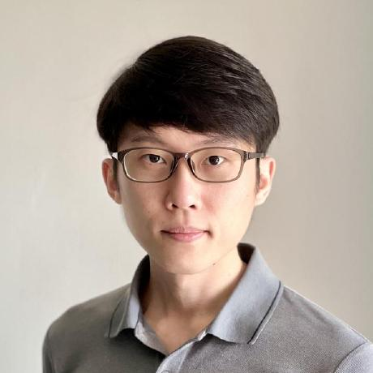

---js
const eleventyNavigation = {
	key: "About",
	order: 3
};
---
# About

I am a Full-Stack Software Engineer since 2016 including professional tenure overseas, a Computer Engineering degree, and an AWS Certified Solutions Architect. Passionate about applying Domain-Driven Design principles to create simple user-centric applications. Brings System Design document writing to every project, demonstrating backend expertise in building scalable systems and enhancing visibility for all stakeholders. 

Currently seeking opportunities to specialise in high-concurrency and distributed systems, leveraging Go (Golang).
