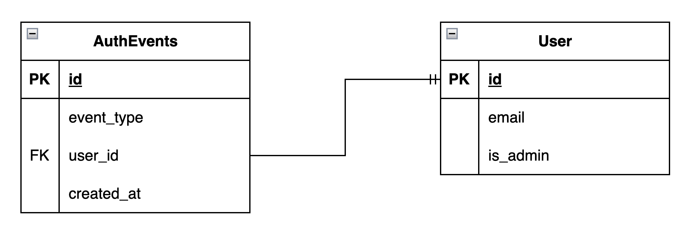
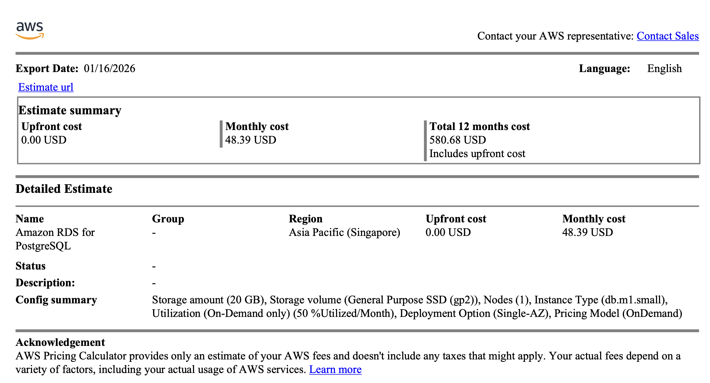
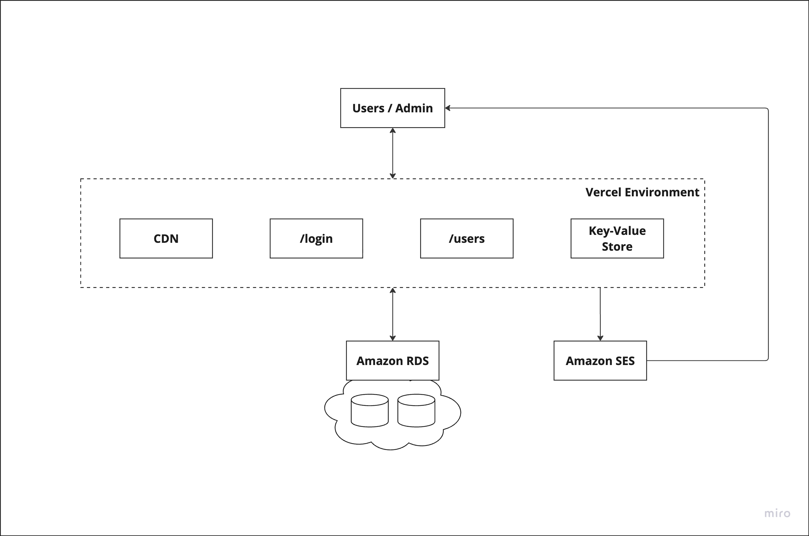

System Design is such a broad topic, with many different styles adopted by different people. It only became popular recently when it became a requirement during interviews for software engineering roles. This blog is not about tips & tricks for passing half-hour session interviews, but a more realistic take on building systems that lasts.

<div class="message-box">
	<p><em>The basic study of system design is the understanding of component parts and their subsequent interaction with one another.<br/>- Wikipedia</em></p>
</div>

Every system is built to solve a problem faced by someone or a business, and people tend to lose sight of that when the team or organisation starts growing. This could be because of how workers are hired for a specific role within a problem but are not directed to solve the business problem. As it is human nature to want to suceed and improve, these individual workers start implementing and improving onto their individual areas in isolation, which Inevidently, results in creating a more complicated and messy system over time.

<div class="message-box">
	<p><em>The heart of software is its ability to solve domain-related problems for its user.<br/>- Eric Evans</em></p>
</div>

That is where Domain Driven Design (DDD) comes in, as it brings the problem-solving focus back to the actual issue at hand. It starts by formalizing the language used by the domain-experts and stakeholders, such that engineers can actually use those terminologies during their design and implementation. This solves a huge communication gap between the non-technical and technical folks. As conversations regularly take place between stakeholders, DDD provides a framework for capturing important details in the domain. These details are also commonly known as Objects & Events in the software engineering world (more on that later).

I will not be diving deep into what DDD is in this blog, but will cherry-pick concepts from it to apply to my approach to System Design. 

To give you a glimpse of what I am talking about, below is a simple System Design document leveraging DDD for building an authentication service for XYZ startup. These System Design documents are living documents that gets updated over time, and what is shown below is just a snapshot in the whole system life cycle.

# XYZ Auth
Company XYZ requires a secure way to authenticate its users accessing its app. To keep costs low, and not be subjected to GDPR related policies, passwords cannot be stored within the system. Consulting with the Security Engineer in the team, he advises to use Magic Links as a quick and simple way to authenticate users.

## Table of Contents
-----
1. [DDD Strategic Design](#ddd-strategic-design)
2. [DDD Tactical Design](#ddd-tactical-design)
3. [Non-Functional Requirements](#non-functional-requirements)
3. [API Endpoints](#api-endpoints)
4. [Capacity Estimation](#capacity-estimation-(data-storage))
5. [Cost Estimation](#cost-estimation)
6. [System Architecture](#system-architecture)

## System Design
-----

### __DDD Strategic Design__

<div class="message-box">
	<p><em>The goal of strategic design is to formalize the language between stakeholders and can be categorized into 3 categories: (1) Events; (2) Objects; (3) Transactions.</em></p>
  <p><em>Events represent the past and act as the source of truth; they are stored in databases. Objects are models that represent the current state of the domain and are derived from the events that occur over time. Transactions work with objects within the domain to generate events that changes the various objects of the domain.</em></p>
  <p><em>Conversations need to happen with the Domain Experts, and I personally use a simple Persona table to describe such conversations on what they expect the interaction will be like.</em></p>
</div>

The expected interactions with __```XYZ Auth```__ are as follows:
<div class="simple-table-container">
  <table class="simple-table">
    <thead>
      <tr>
        <th>Persona</th>
        <th>Interaction</th>
      </tr>
    </thead>
    <tbody>
      <tr>
        <td>User</td>
        <td>User enters email and requests for Magic Link.</td>
      </tr>
      <tr>
        <td>User</td>
        <td>User clicks on Magic Link and navigates to the Home page of the App.</td>
      </tr>
      <tr>
        <td>User</td>
        <td>User clicks on expired / invalid Magic Link and navigates to the HTTP 401 page of the App.</td>
      </tr>
      <tr>
        <td>Admin</td>
        <td>Admin enters email and requests for Magic Link.</td>
      </tr>
      <tr>
        <td>Admin</td>
        <td>Admin clicks on Magic Link and navigates to the Admin App.</td>
      </tr>
      <tr>
        <td>Admin</td>
        <td>Admin adds Users to the system by entering their emails.</td>
      </tr>
      <tr>
        <td>Admin</td>
        <td>Admin removes Users from the system by deleting their emails.</td>
      </tr>
    </tbody>
  </table>
</div>

The domain of __```XYZ Auth```__ is as follows:

<div class="simple-table-container">
  <table class="simple-table">
    <thead>
      <tr>
        <th>Events</th>
        <th>Objects</th>
        <th>Transactions</th>
      </tr>
    </thead>
    <tbody>
      <tr>
        <td>UserAdded</td>
        <td>User</td>
        <td>AddUser</td>
      </tr>
      <tr>
        <td>UserRemoved</td>
        <td></td>
        <td>RemoveUser</td>
      </tr>
      <tr>
        <td>UserRequestsMagicLink</td>
        <td></td>
        <td>RequestMagicLink</td>
      </tr>
      <tr>
        <td>UserLogin</td>
        <td></td>
        <td>LoginUser</td>
      </tr>
    </tbody>
  </table>
</div>

### __DDD Tactical Design__

<div class="message-box">
	<p><em>This section is where a software engineer provides technical artifacts such as ER diagrams or sequence diagrams.</em></p>
</div>
<br/>


Based on the events and objects identified in the _Strategic Design_ stage, the above Entity-Relationship diagram is drawn.

### __Non-Functional Requirements__

<div class="message-box">
	<p><em>Non-Functional requirements are tricky; and can very often be mixed up with the Domain requirements.</em></p>
	<p><em>These are very important requirements that are not part of the domain.</em></p>
</div>

* The Magic Link will only work on the same browser that was used to generate the Magic Link. This is enforced using CSRF tokens.

### __API Endpoints__

<div class="message-box">
	<p><em>The endpoints are derived from transactions needed in the Strategic Design phase</em></p>
</div>

```bash
POST /api/v1/login
POST /api/v1/login?magic={string}
POST /api/v1/users
POST /api/v1/users/{id}
GET /api/v1/users
GET /api/v1/users/{id}
```

### __Capacity Estimation__ (Data Storage)

<div class="message-box">
	<p><em>Using the ER diagrams described in the Tactical Design stage, provide a back-off-the-envelope estimation of the storage / memory needed for an estimated number of users.</em></p>
</div>

Referencing the data structures for [Postgres](https://www.postgresql.org/docs/current/datatype.html), the estimation is as follows:

```code
id: 16 bytes
event_type: 1 byte * size = 16 bytes
user_id: 16 bytes
created_at: 16 bytes
email: 128 bytes
is_admin: 1 byte
```
Hence, an AuthEvent is estimated to be at most ```(16 + 16 + 16 + 16 + 128 + 1) = 193 bytes```.

With a ```1GB``` Postgres instance, we can store approximately ```~5.1 million``` auth events.

### __Cost Estimation__

<div class="message-box">
	<p><em>Based on the estimates done earlier, you can also estimate the cost of your design. Depending on your service provider, there may be calculators available to estimate the costs of the system.</em></p>
</div>

[AWS Calculator](https://calculator.aws/#/createCalculator/RDSPostgreSQL)



### __System Architecture__

<div class="message-box">
	<p><em>This is where the whole architecture of your system is shown. If the system is large, you may add accompanying flow diagrams as well.</em></p>
</div>
<br/>


-----


<style></style>
<style></style>
