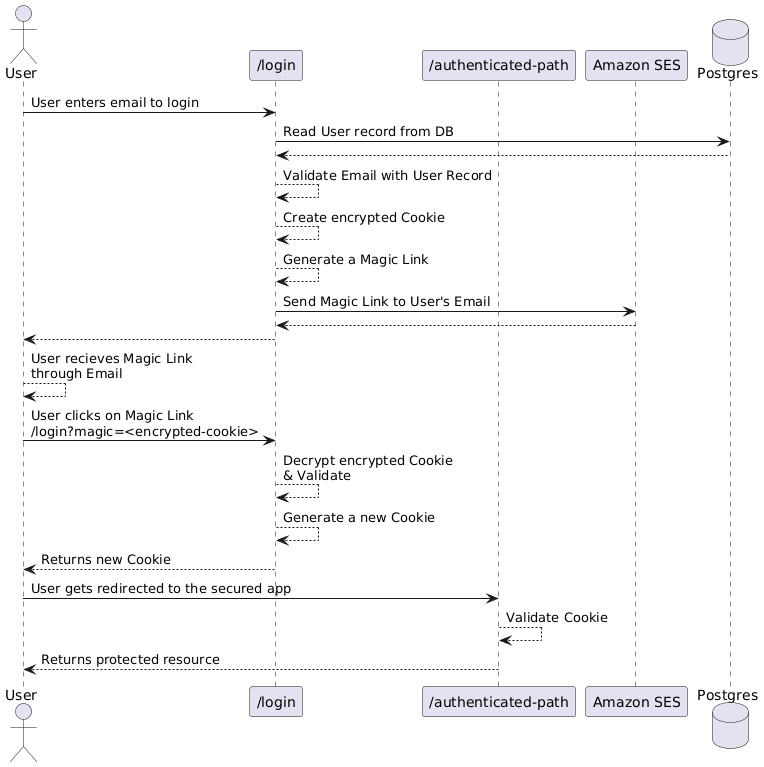

 
 

	
<em>This is <strong>Part 2</strong> of the Magic Link System Design Series.</em>

  <ol>
    <li><a href="/blog/2-system-design">System Design</a></li>
    <li>Magic Links</li>
    <li><a href="/blog/4-csrf-magic-links">CSRF with Magic Links</a></li>
    <li><a href="/blog/5-pprof">pprof & Load Testing</a></li>
    <li><a href="/blog/6-pprof-analysis">pprof Analysis</a></li>
    <li><a href="/blog/7-pprof-mem">pprof Memory Optimizations</a></li>
    <li><a href="/blog/8-pprof-cpu">pprof CPU</a></li>
  </ol>

 

	
<em>"Hey Shannon! Your previous post talks about Magic Links but there were no details at all about implementing them!" - random reader</em>

Hey, I hear you! In the [previous post](../2-system-design/), I gave an example System Design writeup for XYZ Auth to implement Magic Links for the organisation. However, remember that System Design documents are living documents, and the previous post was just to highlight the structure of the document. 

In this post we will build upon the System Design in the previous post with details on how Magic Links will be implemented. Specifically, we will create technical artifacts to be placed in the [Tactical Design](../2-system-design/#ddd-tactical-design) section of the System Design document.

	
<em>Magic Links are a mechanism for users to access secure resources without needing to enter passwords.</em>

### Sequence Diagrams

The best way to explain how Magic Links work is to use Sequence Diagrams.

The above [sequence diagram](https://www.plantuml.com/plantuml/uml/ZP9FRzGm4CNl_XIZ7k0KSL-Lqj9MN8g4ke9JBrDxIAnDx6Wyfe9FZ_yqQK8s4hTavlt6Rvvz7GHPuj0hrE8PlWTYm00n4AinjQos8pg1Ym-zRwsxo4qSnuVyyuy0etJaKW65J3EYT9FwPjbPKpS3_l4EZlV78gO1RQyC2ZvZ8FZcWxHC8RVCirBP5ZHNimCuLCVaXFYL1l5GlAf9bOX49-qZeQa0a_Piu2Vx0Uu-loalcoP95-Jwi1_OMuD2S5zEUh7IrNcFPTukTykKANAQVuz21cwzFrdQrNyXHvm9XA_OMWqFrfrM-zHL3t0aPnOQ45yClG_Lucgp2jKGy-_Kct9DOyl7OSx8qYyAY_5FJZhsiUtgzDtxqBtLfm3UhTZwX3uDkVJnSWwZqIMCgzqqxgWeD_4zkNVpZVnFb8vUNibj1kLrI6GNDh8wR_M6fprRaW1CnZBfN1OFIGM1T4pLZAaDsfoTDozopk5A-sPqP2_rNARW8sjIr-HC7Fg_) shows the happy path of a Magic Link usage.

1. Users enter their email in the Login page.
2. The backend checks if the email exists in the database.
3. If the email exists, generate an encrypted cookie detailing who the user is.
4. Create a Magic Link with the encrypted cookie as a URL param.
5. Send the Magic Link to the user's email address.
6. User clicks the Magic Link, and upon success, gets redirected to the protected page.

One of the beautiful features of Magic Links is that they use Stateless Cookies. Stateless means that the backend does not need to verify if the content in the Cookie is valid or not; it simply trusts it. This greatly reduces the number of network calls to databases as shown in the sequence diagram above; there is only 1 database call at the beginning, and future visits to protected resources will simply succeed if the Cookie has not expired.

	
<em>"But won't clients just mutate their Cookies to impersonate other people?" - concerned reader</em>

In order to prevent manipulation of the Cookie, the Cookie will be encrypted by the server during creation. Only the server has the private key, hence adversaries will not be able to mutate the Cookie to suit their needs. Referring to the [System Architecture](../2-system-design/#system-architecture) diagram in the previous post, these private encryption keys will be stored in Vercel's Key-Value stores, such that the backend will have access to them to decrypt / validate incoming requests and their respective Cookies.

### Non-Functional Requirements

There are security pitfalls associated with Stateless Cookies, and these need to be captured in the [Non-Functional Requirements](../2-system-design/#non-functional-requirements) of a System Design document.

Example Additional requirements:
* The encryption key needs to be rotated every 7 days.
* The Cookie in the Magic Link should expire within 15 minutes.
* Refreshed Cookies should expire within 60 minutes, before needing a new Magic Link.
* To adopt the [Double-Submit Cookie Pattern](https://cheatsheetseries.owasp.org/cheatsheets/Cross-Site_Request_Forgery_Prevention_Cheat_Sheet.html#alternative-using-a-double-submit-cookie-pattern), when generating a Cookie.

	

    <em>
      Check out my new Go library for creating encrypted Cookies!
       
      <a href="https://github.com/sh4nnongoh/ironsession" target="_blank" rel="noopener noreferrer">
        https://github.com/sh4nnongoh/ironsession
      </a>
    </em>
  

