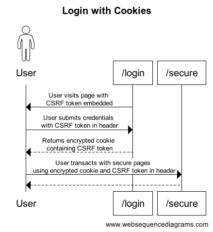
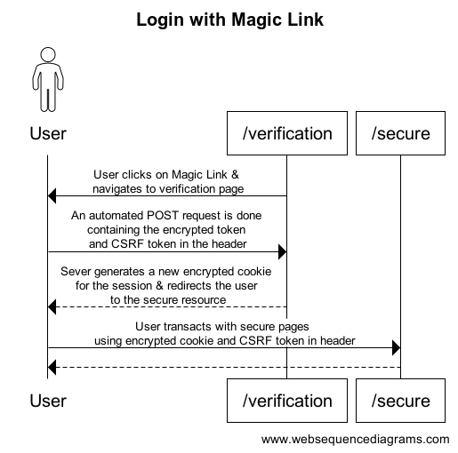

<br/>
<br/>
<div class="message-box">
	<p><em>This is <strong>Part 3</strong> of the Magic Link System Design Series.</em></p>
  <ol>
    <li><a href="/blog/2-system-design">System Design</a></li>
    <li><a href="/blog/3-magic-links">Magic Links</a></li>
    <li>CSRF with Magic Links</li>
    <li><a href="/blog/5-pprof">pprof & Load Testing</a></li>
    <li><a href="/blog/6-pprof-analysis">pprof Analysis</a></li>
    <li><a href="/blog/7-pprof-mem">pprof Memory Optimizations</a></li>
    <li><a href="/blog/8-pprof-cpu">pprof CPU</a></li>
  </ol>
</div>

As a recap, a Magic Link contains an encrypted token containing the identity of a particular user. By that definition, anyone clicking that link can impersonate the identify encoded in the link. Doesn't that sound familiar? (*Cough, Cough* - __Netflix__)

In order to prevent that we need a way for the link to only work for the original requester, and that is where _CSRF tokens_ come in handy.

<div class="message-box">
  <p><em>
  Cross-Site Request Forgery (CSRF) is an attack that forces an end user to execute unwanted actions on a web application in which they’re currently authenticated. With a little help of social engineering (such as sending a link via email or chat), an attacker may trick the users of a web application into executing actions of the attacker’s choosing. If the victim is a normal user, a successful CSRF attack can force the user to perform state changing requests like transferring funds, changing their email address, and so forth. If the victim is an administrative account, CSRF can compromise the entire web application.
  <br/>
  - OWASP
  </em></p>
</div>

### CSRF + Cookies

Before discussing _CSRF tokens_ with _Magic Links_, let's take a look at how _CSRF tokens_ work with cookies. After a user gets authenticated, a cookie is usually created by the server and assigned to the user. This cookie would contain data identifying the user, and will be attached to every request made by the user to the server. Knowing this, an adversary could trick users into submitting authenticated transactions without their knowledge. A common example would be the user visiting the adversary site which triggers requests to a known webapp used by the user.

```html
<!-- Adversary site has the following elements -->

 <!-- A form that secretly performs a POST 
  to a known site used by the User -->
<form action="https://bank.example.com/transfer" method="POST">
  <input type="hidden" name="to_account" value="attacker123">
  <input type="hidden" name="amount" value="1000">
</form>

<!-- OR -->

<!-- Loading an img element which basically 
 performs a hidden GET request -->


```

<div class="message-box">
  <p><em>
  A CSRF token is a nounce of a certain size that is random across sessions and users.
  </em></p>
</div>

In order to prevent such attacks, the _CSRF token_ needs to be sent with the requests alongside the authentication cookies. The server will compare the request's _CSRF token_ with the session's state, which could either be stored server-side like in Redis, or [in our scenario](/blog/3-magic-links/#sequence-diagrams), in the encrypted cookie.



The above [sequence diagram](https://www.websequencediagrams.com/?lz=dGl0bGUgTG9naW4gd2l0aCBDb29raWVzCgphY3RvciBVc2VyCgovbAAcBS0-AAsFIDoAAQZ2aXNpdHMgcGFnZQA2BlxuQ1NSRiB0b2tlbiBlbWJlZGRlZAoKAC8FLT4gAEAGADYHc3VibWl0cyBjcmVkZW50aWFscyBcbgB9BgA7CmluIGhlYWRlcgB6CQB6ClJldHVybnMgZW5jcnlwdGVkIGMAgTcFIFxuY29udGFpbmluZwBCCwB-C3NlY3VyZQCBQAh0cmFuc2FjdHMAgXwGABYHcGFnZXMgXG51c2luZwBTEmFuZACBEhcAVgcAgSAKCg&s=default) shows the following:

1. When the user navigates to the _/login_ page, a _CSRF token_ generated by the server is present in the _meta_ tag of the page.
2. Upon logging in, the _CSRF token_ is attached in the _header_ of the _POST_ request along with the login credentials.
3. The server verifies the credentials and, if successful, creates an encrypted cookie containing the user's identity along with the _CSRF token_.
4. Any future authenticated requests made to the server will have the attached _CSRF token_ in the header compared with the _CSRF token_ stored in the encrypted cookie. Even if the cookie is valid, an invalid _CSRF token_ check will render the request invalid.

There is no way for an adversary site to capture this _CSRF token_ embedded in our site.

### CSRF + Magic Links

A _Magic Link_ basically has the encrypted cookie as part of the URL. The question now is how does the user send the _CSRF token_ in the header by just clicking a link? You might have noticed when using certain secure sites like banking, there is some sort of _"/verification"_ intemediary page before the site shows you your dashboard. This intermediary page actually captures the encrypted cookie in the _Magic Link_ along with the _CSRF token_ in the browser and performs the actual POST request of logging into the secure site.



The above [sequence diagram](https://www.websequencediagrams.com/cgi-bin/cdraw?lz=dGl0bGUgTG9naW4gd2l0aCBNYWdpYyBMaW5rCgphY3RvciBVc2VyCgovdmVyaWZpY2F0aW9uIC0-ABIFIDoAAQZjbGlja3Mgb24ANAsgJiBcbm5hdmlnYXRlcyB0byAANQ1wYWdlCgA_BS0-IABPDjogQW4gYXV0b21hdGVkIFBPU1QgcmVxdWVzdCBpcyBkb25lIFxuY29udGFpbmluZyB0aGUgZW5jcnlwdGVkIHRva2VuIFxuYW5kIENTUkYACgdpbgAjBWhlYWRlcgCBPxAAgUYKU2V2ZXIgZ2VuZXIAgTMFYSBuZXcAUwtjb29raWUgXG5mb3IAdAVzZXNzaW9uICYgcmVkaXJlY3RzAIEMBXVzZXIgXG50bwAfB2N1cmUgcmVzb3VyY2UKAIFxCgATBwCCQwd0cmFuc2FjdHMAgwgGADAHcGFnZXMgXG51c2luZwB7EgCBWBIAgV4IAHAHAIFWCgo&s=default) shows the following:

1. The _Magic Link_ navigates the user to the _"/verification"_ page.
2. The _"/verification"_ page performs a POST request with the encrypted cookie and _CSRF token_ to login the user.
3. The server decrypts the cookie and compare the embedded _CSRF token_, with the token in the _header_.
4. If valid, a new session is created for the user with a new encrypted cookie returned to the user.
5. Future requests to the secure site, will have the encrypted cookie in the request. The client will have to send the _CSRF token_ in the header for the requests to be successful.

When navigating the secure site through the UI, the _CSRF token_ can be easily accessed to be attached to the request. However, if the user were to click on a link to access the site, a _"/verification"_ page willstill be needed to properly authenticate the user by capturing the _CSRF token_ in the browser.

So back to the issue at hand, the _Magic Link_ needs to only work in the same browser that triggers the _Magic Link_ generation. Similar to the _/login_ page example in the previous section, the _CSRF token_ is embedded in the browser when the users generate a _Magic Link_ with their email. Therefore, the Magic Link sent to their emails will only work if the users open the links with the same browser session that triggered the generation; as that is where the _CSRF token_ is embedded.

## Implemention

In this section we will cover the implementation details for a minimal CSRF Magic Link example with _Go_, _Gin_, _HTML templating_, and _HTMX_. 

_HTMX_ is amazing but we will not be covering that in this post.

The web server is setup as follow:
```go
package main

import (
	"crypto/rand"
	"net/http"

	"github.com/gin-contrib/sessions"
	"github.com/gin-contrib/sessions/cookie"
	"github.com/gin-gonic/gin"
	"github.com/gorilla/securecookie"
)

func main() {
    // (1) Defining keys & store
	authKeyMagic := make([]byte, 32)
	encryptKeyMagic := make([]byte, 32)
	rand.Read(authKeyMagic)
	rand.Read(encryptKeyMagic)
	codec := securecookie.New(authKeyMagic, encryptKeyMagic)
	codec.MaxAge(60 * 60 * 15)
	codecs := []securecookie.Codec{codec}

	authKeyCookie := make([]byte, 32)
	encryptKeyCookie := make([]byte, 32)
	rand.Read(authKeyCookie)
	rand.Read(encryptKeyCookie)
	storeCookies := cookie.NewStore(authKeyCookie, encryptKeyCookie)
	storeCookies.Options(sessions.Options{
		Path:     "/",
		MaxAge:   60 * 60 * 60 * 3,
		HttpOnly: true,
		Secure:   false,
	})

    // (2) Routes
	router := gin.Default()
	err := router.SetTrustedProxies([]string{"127.0.0.1"})
	if err != nil {
		panic(err)
	}
	router.LoadHTMLGlob("templates/*.go.tmpl")
	router.Static("/static", "./static")
	router.Use(sessions.Sessions(COOKIE_STORE_NAME, storeCookies))
	router.POST("/magic/generate", handleMagicLinkGeneration(codecs))
	router.POST("/magic/verify/:magic", handleMagicLinkVerification(codecs))
	router.GET("/magic/verify/:magic", func(c *gin.Context) {
		c.HTML(http.StatusOK, "check-auth.go.tmpl", gin.H{
			"route": "",
		})
	})
	router.GET("/secure/:id", func(c *gin.Context) {
		c.HTML(http.StatusOK, "check-auth.go.tmpl", gin.H{
			"route": c.Request.URL.Path,
		})
	})
	router.POST("/secure/:id", handleSecure)
	router.GET("/login", MiddlewareNoCache(), func(c *gin.Context) {
		c.HTML(http.StatusOK, "login.go.tmpl", gin.H{
			"csrfToken": generateCsrf(),
		})
	})
	router.Run()
}
```

#### (1) Defining keys & store
<div class="message-box">
  <p><em>
  Hash-based Message Authentication Code (HAMC), is a cryptographic technique that combines a hash function with a secret key to verify the integrity and authenticity of a message. It ensures that the message has not been altered during transmission and confirms that it comes from a legitimate source.
  </em></p>
</div>
<br/>

The reason why we have 2 keys, is that one is used for _HMAC_ while the other is for encryption. _HMAC_ is needed so that adversaries are not able to successfully mutate the ciphertext of the encrypted cookie such that the decrypted version is still semantically valid.

We also define 2 separate key pairs as one is for _Magic Links_, while the other is for the actual encrypted session cookies.

The expiry of the keys are defined here as well and should match what is stated in the [Non-Functional requirements](/blog/3-magic-links/#non-functional-requirements).

#### (2) Routes

You may have noticed that secured routes have both a _GET_ and a _POST_ method. This is to support URL navigation, whereby the _check-auth_ page is rendered to capture the _CSRF token_ in the browser before attempting to retrieve the secured resources with a _POST_.

#### (3) Minimal Javascript

```javascript
// Read from meta tag and store in localStorage
const csrfMeta = document.querySelector('meta[name="csrf-token"]')?.content;
if (csrfMeta) {
  localStorage.setItem('csrfToken', csrfMeta);
}

// Attach CSRF token from meta tag or localstorage to HTMX request
document.addEventListener('htmx:configRequest', (event) => {
  event.detail.headers['X-CSRF-Token'] =
    csrfMeta || localStorage.getItem('csrfToken')
});
```

With _HTMX_, there is minimal need to introduce _javascript_ into our webapp. However, as we will be using the browser's _localstorage_ to store the _CSRF token_, _javascript_ is still needed. The above code snippet shows the minimal code needed to store and retrieve the _CSRF token_.

#### Demo

<video controls width="720">
  <source src="/videos/csrf.mp4" type="video/mp4">
  Your browser does not support the video tag.
</video>

The above video shows the full capabilities of our Magic Link site!

<div class="message-box">
	<p>
    <em>
      Check out the example project here!
      <br/>
      <a href="https://github.com/sh4nnongoh/go-csrf-magic-links" target="_blank" rel="noopener noreferrer">
        https://github.com/sh4nnongoh/go-csrf-magic-links
      </a>
    </em>
  </p>
</div>


<style></style>
<style></style>
