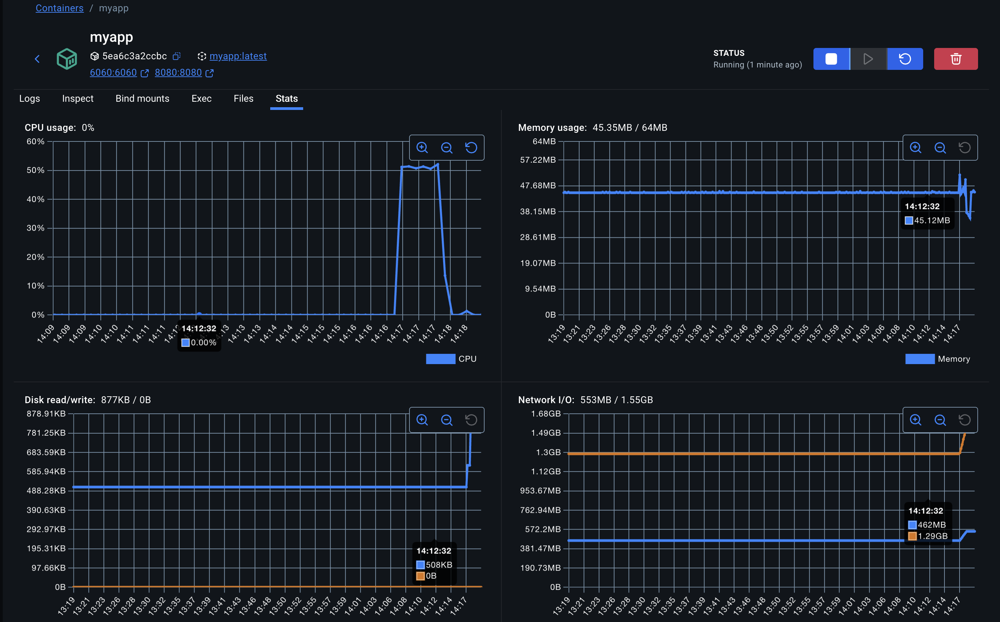

<br/>
<br/>
<div class="message-box">
  <p><em>
  pprof is a tool for visualization and analysis of profiling data. It reads a collection of profiling samples in profile.proto format and generates reports to visualize and help analyze the data. It can generate both text and graphical reports (through the use of the dot visualization package).
  <br/>
  - Google
  </em></p>
</div>

In the [previous post](/blog/4-csrf-magic-links), we built a simple ```Go``` webapp using the ```Gin``` webserver for authentication of users using ```Magic Links```. However, how do we know that it actually works at scale? We need a way to benchmark the app with proper load and see if it can withhold the number of users expected to use our app. This is where [pprof](https://github.com/google/pprof) comes in handy, as it is already built into the Go package.

```go
import (
	// ...

	//nolint:gosec // G108: pprof is only exposed on internal environments
	_ "net/http/pprof"

    // ...
)

func main() {
	// Start pprof HTTP server
	go func() {
		srv := &http.Server{
			Addr:         ":6060",
			ReadTimeout:  5 * time.Second,
			WriteTimeout: 5 * time.Second,
			IdleTimeout:  5 * time.Second,
		}

		if err := srv.ListenAndServe(); err != nil && err != http.ErrServerClosed {
			log.Fatalf("server failed: %v", err)
		}
	}()
    // ...
}
```

Importing the ```"net/http/pprof"``` package and spinning up a ```http server```, will enable pprof analysis at the ```/debug/pprof/``` route of your application. As a sidenote, ```gosec``` linting package will flag this as a security issue as it assumes you are exposing profiling data publicly. Remember that in the larger system architecture, your webserver will not be public facing and is usually hidden behind a proxy. A bastion host is usually setup for system administrators or engineers to interact with the pprof endpoints. Therefore, we can ignore this specific linting rule.

```bash
BASE_URL=http://localhost:6060
SAMPLING_PERIOD=30

# CPU Profile
curl -s "${BASE_URL}/debug/pprof/profile?seconds=${SAMPLING_PERIOD}"
# I/O Profile
curl -s "${BASE_URL}/debug/pprof/block?seconds=${SAMPLING_PERIOD}"
# Lock Contention Profile
curl -s "${BASE_URL}/debug/pprof/mutex?seconds=${SAMPLING_PERIOD}"
# # To answer: "How many objects are we creating per request?"
curl -s "${BASE_URL}/debug/pprof/heap?seconds=${SAMPLING_PERIOD}"

# Goroutine Profile
curl -s "${BASE_URL}/debug/pprof/goroutine?debug=2"
# Save inuse_objects (currently live objects)
curl -s "${BASE_URL}/debug/pprof/heap"
# Save inuse_space (bytes currently in use)
curl -s "${BASE_URL}/debug/pprof/heap"

# The ?gc=1 parameter triggers garbage collection before sampling

# Save alloc_objects (total allocations during profile)
curl -s "${BASE_URL}/debug/pprof/heap?gc=1"
# Save alloc_space (bytes allocated)
curl -s "${BASE_URL}/debug/pprof/heap?gc=1"

```

Once the server is up, we can gather metrics of our system by perform a ```GET``` request on the respective endpoints shown above. 

We can then use the command line ```go tool``` to evaluate each profile accordingly; i.e. ```go tool pprof -http=:8081 ./cpu.pprof```

The [benchmarking script](https://github.com/sh4nnongoh/go-csrf-magic-links/blob/main/cmd/benchmark/start.sh) is defined in the repository as well.

## Load Testing

Now that our server is ready to gather profiling metrics. We need to write a script to perform actual load on our server.

```go
// ...

const (
	ConcurrentRequestsCount   = 500
	BenchmarkDuractionSeconds = 60
	Host                      = "http://127.0.0.1:8080"
	GenerateMagicRoute        = "/magic/generate"
)

func main() {

    // ...

	client := &http.Client{
		Timeout: 5 * time.Second,
	}

    // (1) Defining Context and Resource Management Constructs
	ctx, cancel := context.WithTimeout(context.Background(), BenchmarkDuractionSeconds*time.Second)
	defer cancel()
	group, ctx := errgroup.WithContext(ctx)
	semaphore := make(chan struct{}, ConcurrentRequestsCount)

loop:
	for {
		select {
		case <-ctx.Done():
			break loop
		default:
            // (2) Trigger Requests in Go Routines
			semaphore <- struct{}{}
			group.Go(func() error {
				defer func() {
					<-semaphore
				}()
				req, err := http.NewRequestWithContext(ctx, http.MethodPost, Host+GenerateMagicRoute, nil)
				if err != nil {
					return err
				}
				req.Header.Set("X-CSRF-Token", generateCsrf())
				res, err := client.Do(req)
				if err != nil {
					return err
				}
                // Important! Need to read the body to release the http connection back to the pool.
				io.ReadAll(res.Body)
				defer res.Body.Close()
				return nil
			})
		}
	}
	if err := group.Wait(); err != nil {
		log.Println("request failed:", err)
	}

    // ...
}
```

In the [```/cmd/benchmark/main.go```](https://github.com/sh4nnongoh/go-csrf-magic-links/blob/main/cmd/benchmark/main.go) directory, a ```Go``` program is written to perform concurrent requests to the server's endpoints.

#### (1) Defining Context & Resource Managment Constructs

A ```context``` is defined with a timeout parameter, to tell our program to exit once it reaches the time limit. This context is attached to an ```errgroup``` which is the construct that performs the actual concurrent requests. _(For those familiar with ```Javascript```, an ```errgroup``` is similar to ```Promise.All()```)._ A Semaphore is also defined which represents the total number of concurrent requests made to our server.

#### (2) Trigger Requests in Go Routines

The whole request lifecycle is encapsulated within a ```Go``` Routine, and this ```Go Routine``` is only triggered once a _lock_ can be claimed from the _semaphore_. For this load testing, the endpoint for ```Magic Link``` generation will be used. An important note when performing a high number of HTTP requests, is that most libraries will pool the HTTP connections such that the program does not overload the number of network sockets on the system. In order for a HTTP connection to be considered ```"completed"```, the ```body``` of the response recieved after perfoming a request needs to be read fully. Otherwise, the HTTP connection will not be returned to the connection pool, and as a result, one will have a scoket exchaution error on the client side performing the load test.

### Docker

<div class="message-box">
  <p><em>
  "What do you mean there is an issue? IT WORKS ON MY MACHINE!"
  <br/>
  - I am always right engineer
  </em></p>
</div>

In order for our experiment to produce consistent results, we leverage on ```Containers``` to encapsulate our program.

```docker
# Stage 1: Build the Go application
FROM golang:1.25-alpine AS builder

WORKDIR /app

# Copy go mod files
COPY go.mod go.sum ./
RUN go mod download

# Copy source code
COPY . .

# Build the application with optimizations
# -ldflags="-s -w" strips debug symbols, reducing binary size
# CGO_ENABLED=0 creates static binary, no C dependencies
RUN CGO_ENABLED=0 GOOS=linux go build -ldflags="-s -w" -a -o main .

# Stage 2: Create minimal runtime image
FROM scratch

# Copy only the built binary, and public assets from the builder stage
COPY --from=builder /app/main /main
COPY --from=builder /app/static /static
COPY --from=builder /app/templates /templates

# Copy CA certificates for HTTPS if needed
# COPY --from=builder /etc/ssl/certs/ca-certificates.crt /etc/ssl/certs/

# Expose ports
EXPOSE 8080 6060

# Run as non-root user for security
USER 1000:1000

# Set minimal environment
ENV GOMAXPROCS=1

# Health check
HEALTHCHECK --interval=30s --timeout=3s --start-period=5s --retries=3 \
  CMD ["/main", "health"] || exit 1

ENTRYPOINT ["/main"]

```
The above script shows a ```Dockerfile```, for packaging our application into a production ready container.

```bash
docker run -d \  --name myapp \
  --memory=64m \     
  --memory-swap=64m \
  --memory-swappiness=0 \
  --cpus="0.5" \
  -p 8080:8080 \
  -p 6060:6060 \
  -e GIN_MODE=release \
  myapp:latest
```

When invoking the container, a strict constrained environment can be defined to test specific areas of our application. An example is shown above.



The parameters of our [Load Testing script](#load-testing) can be defined by experimenting with the values, and observing the stability of the container metrics in the Docker Desktop UI. In our scenario, ```500``` concurrent requests is a good number to start with for a ```64MB``` container.

<style></style>
