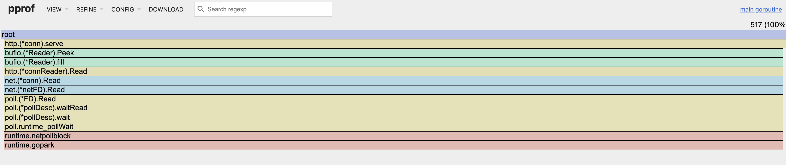
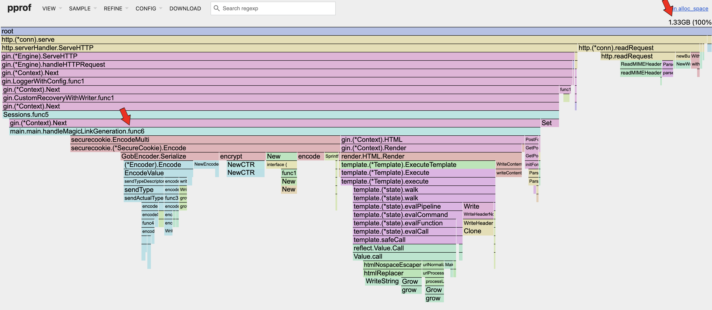
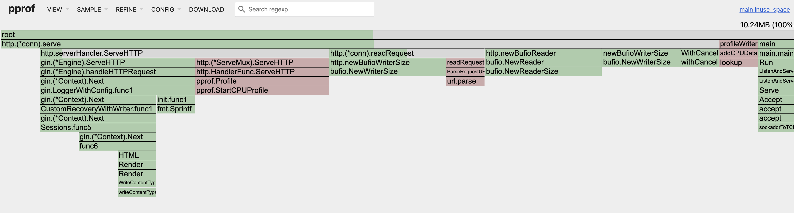
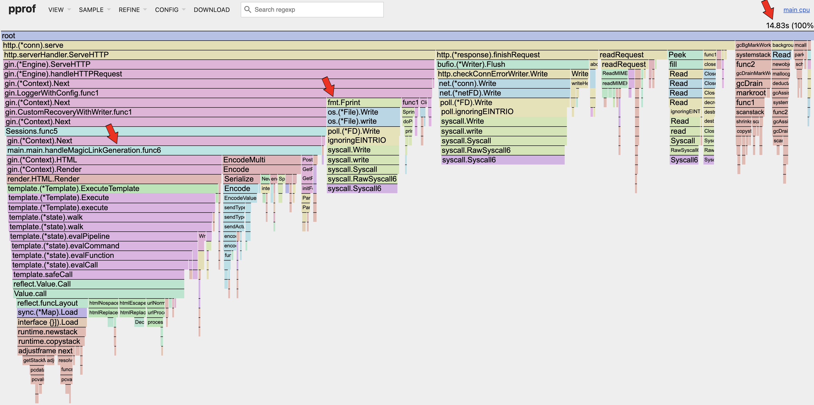

Now that we have generated the [pprof profiles](/blog/5-pprof) for our _Magic Link_ app, let's start analyzing them.

There are a lot of information provided by the profiles, and in order to not get overwhelmed, we need to adopt a strategy to analyze them.

## Strategy

<div class="message-box">
	<p><em>
  Flamegraph is a visualization of hierarchical data to visualize stack traces of profiled software so that the most frequent code-paths can be identified quickly and accurately.
  </em><br>- brendangregg</p>
</div>

We will be mostly using [flamegraphs](https://www.brendangregg.com/flamegraphs.html) to analyze the profile data. Flamegraphs provide a high level overview of the time or resource spent in certain areas of your app, and because it uses a collection of bar graphs, we can easily identify bottlenecks by looking at the width of a bar relative to the overall app.

Below are the various sections of profile analysis, and I recommend going through them sequentially in order to not get overwhelmed.

## Table of Contents
-----
**Resource Utilization**
1. [Blocking Operation](#blocking-operation)
2. [Mutex](#mutex)
3. [Goroutine](#goroutine)
3. [Heap](#heap)
4. [CPU](#cpu)

**Latency Reduction**
1. [CPU](#cpu)

-----

## Resource Utilization

#### Blocking Operation

<div class="message-box">
	<p><em>
  For I/O-bound latency, blocking profiles reveal goroutines waiting.
  Examples include:
  Network calls (HTTP, database, Redis);
  Channel operations with slow consumers;
  Mutex contention (use mutex profile separately).
  </em></p>
</div>
<br>

```bash
go tool pprof -http=:8082 ./block.pprof
```

Most likely due to the fact that we are running everything on _localhost_, hence, there is no information here. Will elaborate more on this in future posts!

#### Mutex

<div class="message-box">
	<p><em>
  The mutex profile builds on the block profile to focus on mutexes.
  </em></p>
</div>
<br>

```bash
go tool pprof -http=:8082 ./mutex.pprof
```

The _Magic Link Generation handler_ is currently not dealing with mutexes for resource sharing, hence, there is no information here.

#### Goroutine

<div class="message-box">
	<p><em>
  The Goroutine profile shows the goroutines present within the sample period, with each branch representing different types of goroutines triggered within the app. When looking at the flamegraph, identify the total number of goroutines spawned in the top right corner. It should be similar to the number of concurrent requests made during the load test. Also to look out for "waiting on channel that never receives" in your application code to identify leaks.
  </em></p>
</div>
<br>

```bash
go tool pprof -http=:8082 ./goroutine.pprof
```
<br>

<p align="center" italic><em>Number of Goroutines</em></p>

By referencing the flamegraph, it can be seen that the number of goroutines spawned (_517_) is approximately equal to the concurrent requests (_500_) made during the load test. It can also be seen that there is only one branch of goroutines which is inline with our implementation. In conclusion, there is no issue here.

#### Heap

<div class="message-box">
	<p><em>
  The heap profile show the amount of memory allocated along with the amount of memory actually in-use during the sample period. By calculating the percentage of the 2 metrics, we can derive the allocated memory utilization of the app. A low allocated memory utilization means that the Garbage Collector (GC) is heavily working to clear objects from memory.
  <br><br>
  By calculating the percentage of the in-use memory with the memory allocated for the app (container), we can also derive the in-use memory utilization of the app. A low in-use memory utilization means that the app is not making full use of the resources available.
  <br><br>
  The goal is to increase the utilizations to an acceptable level, such that there is less pressure on the GC, and making full use of the resources available. Note, that when a GC is active, the app is paused from doing actual work.
  </em></p>
</div>
<br>

```bash
go tool pprof -http=:8082 ./heap_rate.pprof
```
<br>

<p align="center"><em>Heap Allocated Space</em></p>


<br>

<p align="center"><em>Heap In-Use Space</em></p>

Looking at the _2_ flamegraphs above, it can be seen that the in-use space (_10.24MB_) is much smaller than the allocated space (_1.33GB_). That means that the current allocated memory utilization is only **~0.7%**! That is extremely low! The in-use memory utilization is very low as well (_10.24MB_ / _64MB_ ~= **16%**).

There are opportunities for improvements here.

<div class="message-box">
	<p><em>
  "Hey Shannon! I do not understand what the utilization means???"
  <br> - confused reader
  </em></p>
</div>

Remember that our [Docker container](/blog/5-pprof#docker) is only allocated _64MB_ of memory? Have you wondered how is it possible for the memory allocation during load test to reach _1.8GB_? This is because of the wonderful Garbage Collector present in Go programs. It is so efficient that it can handle our badly written code effectively at scale; i.e. _500_ concurrent requests. Memory is constantly allocated per request and discarded at the end. Although the GC is efficient, it still provides an opportunity to make improvements to our app. _People who complain that Rust is faster than Go often skip this step of memory optimization._

Basically, we do not want the allocated memory to grow exponentially over time, such that we rely too much on the GC. Each time the GC runs, the app basically pauses and that introduces latency. Once the allocated memory utilization is stable, we mostly likely can increase the number of concurrent requests to increase the in-use memory utilization, making full use of our resources while increasing throughput.

#### CPU

<div class="message-box">
	<p><em>
  The CPU profile shows the time spent processing tasks in various sections of the app. The CPU utilization of the app can be calculated by taking the percentage of the CPU time spent (top right corner of the flamegraph) against the sample period. A low CPU utilization means that the app can handle more concurrent requests to make more use of the CPU.
  </em></p>
</div>
<br>

```bash
go tool pprof -http=:8082 ./cpu.pprof
```
<br>

<p align="center"><em>CPU</em></p>

The current CPU utilization is (_14.83s_ / _30s_ ~= **49%**). This means that the CPU still has room to process more concurrent requests, but due to the memory issues identified in the previous section, the app can't handle more concurrent requests.

## Latency Reduction

#### CPU

<div class="message-box">
	<p><em>
  When focusing on latency reduction, one needs to dive deep into the sections of the flamegraph to identify optimization areas. Once an area is identified, perform benchmarking to get a baseline of the current metrics, make the necessary improvements, then run the benchmark again to quantify the actual improvements gained.
  </em></p>
</div>
<br>

Referencing the CPU flamegraph in the previous section, we can see that our _Magic Link Generation_ handler consumed _38.6%_ of the overall CPU, and (_38.6%_ / _89.8%_ ~= _43%_) of the _http request & response lifecycle_.

Before optimizing the actual application code written by the developer, we should try to remove or reduce other sections of code that consumes the CPU.

Looking at the _fmt.Fprint_ under the _gin.LoggerWithConfig.func1_ section, we can see that it takes up _9.2%_ of the overall CPU. We can look at optimizing the default _logger_ for _gin_, before optimizing else where.

When dealing with latency, we will need to do proper benchmarking in-order to quantify the potential gains achieved. [Betterstack](https://betterstack.com/community/guides/scaling-go/golang-benchmarking/) has a good article describing this process.

## Conclusion

The priority of optimization tasks is as follows:
1. To increase the allocated memory utilization of the app.
2. To increase the in-use memory utilization of the app.
3. To reduce the latency of our app.

_Stay tuned to future blog posts where we will dive deep into each area!_

<div class="message-box">
	<p>
    <em>
      Check out the example project here!
      <br/>
      <a href="https://github.com/sh4nnongoh/go-csrf-magic-links" target="_blank" rel="noopener noreferrer">
        https://github.com/sh4nnongoh/go-csrf-magic-links
      </a>
    </em>
  </p>
</div>

<style></style>