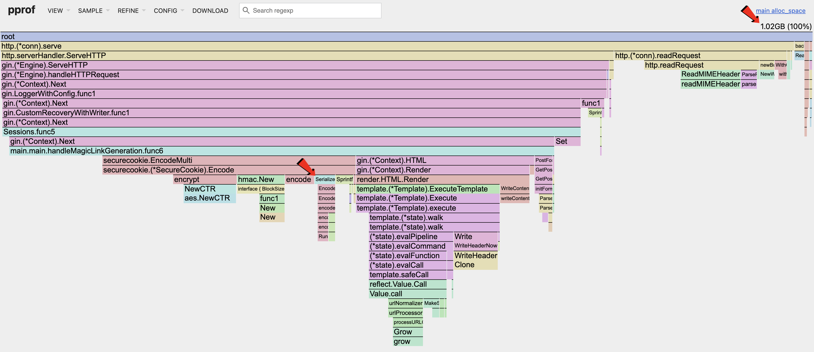
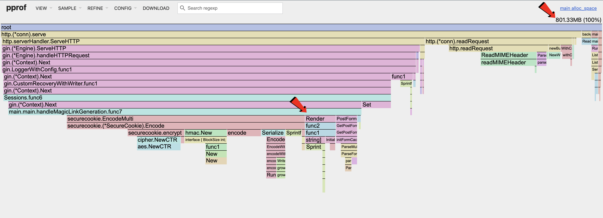

<br/>
<br/>
<div class="message-box">
	<p><em>This is <strong>Part 6</strong> of the Magic Link System Design Series.</em></p>
  <ol>
    <li><a href="/blog/2-system-design">System Design</a></li>
    <li><a href="/blog/3-magic-links">Magic Links</a></li>
    <li><a href="/blog/4-csrf-magic-links">CSRF with Magic Links</a></li>
    <li><a href="/blog/5-pprof">pprof & Load Testing</a></li>
    <li><a href="/blog/6-pprof-analysis">pprof Analysis</a></li>
    <li>pprof Memory Optimizations</li>
    <li><a href="/blog/8-pprof-cpu">pprof CPU</a></li>
  </ol>
</div>

In the [previous post](/blog//6-pprof-analysis/) we identified areas for optimization, with the memory allocation being the most obvious one.


<p align="center"><em>Heap Allocated Space</em></p>

The _Magic Link Generation_ handler has 2 main areas with high memory allocation: [**(1) Cookie Serialization**](#cookie-serialization); [**(2) HTML Generation**](#html-generation).

## Cookie Serialization

The serializer exists to convert client information, in the form of key-value pairs, into an encoded string that represents the cookie. This cookie is attached to the HTTP request.

```go
// Serialize encodes a value using gob.
func (e GobEncoder) Serialize(src interface{}) ([]byte, error) {
	buf := new(bytes.Buffer)
	enc := gob.NewEncoder(buf)
	if err := enc.Encode(src); err != nil {
		return nil, cookieError{cause: err, typ: usageError}
	}
	return buf.Bytes(), nil
}
```

Looking at the [Serialize](https://github.com/gorilla/securecookie/blob/v1.1.2/securecookie.go#L431) function above, each time it is called a new _bytes buffer_ is created. This is inefficient as the buffer will be discarded after each request; we need a way to reuse the buffer across requests.

[Sync Pool](https://pkg.go.dev/sync#Pool) is a library that aims to solve this, by creating a pool of objects that can be reused without triggering the GC.

Furthermore, the _GobEncoder_ uses reflection to infer types during runtime which takes up memory and introduces latency.

[_go-json_](https://github.com/goccy/go-json/) is a library aimed to solve these shortcomings by using _Sync Pool_ for buffer reuse along with other optimizations mentioned [here](https://github.com/goccy/go-json/tree/master?tab=readme-ov-file#basic-technique).

```go

import (
   // ...
	"bytes"

	"github.com/goccy/go-json"
)

type JSONEncoder struct{}

func (e JSONEncoder) Serialize(src interface{}) ([]byte, error) {
	var data interface{}
	switch v := src.(type) {
	case map[string]interface{}:
		data = src
	case map[interface{}]interface{}:
		converted := make(map[string]interface{})
		for k, val := range v {
			converted[fmt.Sprint(k)] = val
		}
		data = converted
	default:
		data = src
	}
	buf := new(bytes.Buffer)
	enc := json.NewEncoder(buf)
	if err := enc.Encode(data); err != nil {
		return nil, cookieError{cause: err, typ: usageError}
	}
	return buf.Bytes(), nil
}

func (e JSONEncoder) Deserialize(src []byte, dst interface{}) error {
	dec := json.NewDecoder(bytes.NewReader(src))
	if err := dec.Decode(dst); err != nil {
		return cookieError{cause: err, typ: decodeError}
	}
	return nil
}

func main() {
  // ...
  codec := securecookie.New(authKeyMagic, encryptKeyMagic)
  codec.SetSerializer(JSONEncoder{})
  // ...
}
```

Since we are using JSON encoding, we need to cast the _interface{}_ data type to _map[string]interface{}_, in order for the library to serialize successfully.


<p align="center"><em>Heap Allocated Space Serializer Optimized</em></p>

By switching to the new library, we can see the allocated memory drop by _~300MB_! That is a significant improvement.

## HTML Generation

The default HTML template parses the the file system for template files and uses reflection at runtime to infer what the HTML should be as seen in the flamegraph. This is done for each request and is extremely slow and memory inefficient.

Using the [Templ](https://github.com/a-h/templ) library, these HTML templates are converted to Go code in the build stage, and compiles down to native binary together with the webserver. As a result, rendering a HTML response is extremely fast with minimal memory allocations.


<p align="center"><em>Heap Allocated Space HTML Optimized</em></p>

By switching to the new library, we can see the allocated memory further drop by _~200MB_! That is another significant improvement.

<div class="message-box">
	<p>
    <em>
      Check out the example project here!
      <br/>
      <a href="https://github.com/sh4nnongoh/go-csrf-magic-links/tree/templ" target="_blank" rel="noopener noreferrer">
        https://github.com/sh4nnongoh/go-csrf-magic-links/tree/templ
      </a>
    </em>
  </p>
</div>

<style></style>
