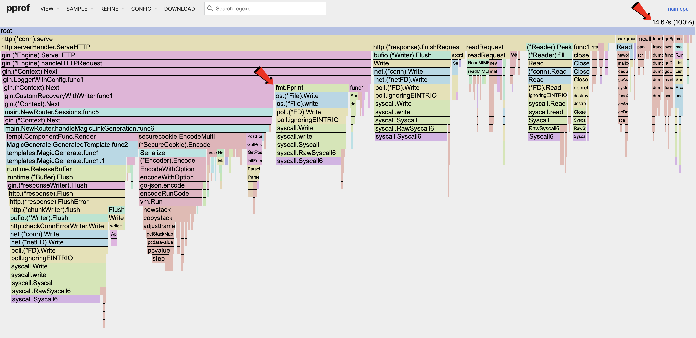
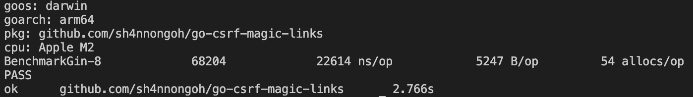
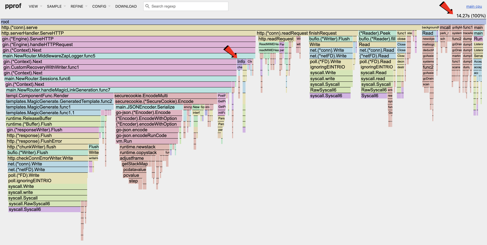

<br/>
<br/>
<div class="message-box">
	<p><em>This is <strong>Part 7</strong> of the Magic Link System Design Series.</em></p>
  <ol>
    <li><a href="/blog/2-system-design">System Design</a></li>
    <li><a href="/blog/3-magic-links">Magic Links</a></li>
    <li><a href="/blog/4-csrf-magic-links">CSRF with Magic Links</a></li>
    <li><a href="/blog/5-pprof">pprof & Load Testing</a></li>
    <li><a href="/blog/6-pprof-analysis">pprof Analysis</a></li>
    <li><a href="/blog/7-pprof-mem">pprof Memory Optimizations</a></li>
    <li>pprof CPU</li>
  </ol>
</div>
<br>

<p align="center"><em>CPU</em></p>

The above CPU flamegraph shows the CPU utilization after the memory optimizations made in the [previous post](../7-pprof-mem/7-pprof-mem.md).

As seen in the flamegraph, the _Magic Link_ handler takes up less than half of the CPU utilization during the sample period. This is expected as it is a very simple handler. Majority of the compute in the handler is used for encryption, while the rest is part of the HTTP lifecycle.

One area of optimization would be the _fmt.Fprint_ section that is part of the _Gin_ logger. Every request coming in will be logged synchronously, triggering _syscalls_ which consumes CPU utilization.

## Benchmarks

When dealing with CPU utilization or latency, we need to gather baseline metrics of our system before making improvements, such that we can compare the results.

```go
// benchmark_test.go
package main

import (
	"net/http"
	"net/http/httptest"
	"testing"
)

const (
	Host               = "http://127.0.0.1:8080"
	GenerateMagicRoute = "/magic/generate"
)

func BenchmarkGin(b *testing.B) {
	router := NewRouter(true)
	req, err := http.NewRequest(http.MethodPost, Host+GenerateMagicRoute, nil)
	req.Header.Set("X-CSRF-Token", generateCsrf())
	if err != nil {
		b.Error(err)
		return
	}
	b.ResetTimer()
	for b.Loop() {
		w := httptest.NewRecorder()
		router.ServeHTTP(w, req)
	}
}

```

The above code shows a simple benchmark test that is focus on the _Magic Link_ handler, with the results shown below.


<p align="center"><em>Benchmark Results (baseline)</em></p>

### Metrics Legend

| Symbol  | Description |
|---------|-------------|
| op      | Operation   |
| ns      | Nano-seconds|
| allocs  | Number of Memory Allocations |
| B       | Bytes Allocated |


## Buffered Logging

Writing logs to disk synchronously per request is slow. Unless your system is fragile, and you fear that logs go missing on your critical path, it makes sense to buffer the incoming logs before writing them to disk; grouping such calls reduce _syscalls_.

The logging library [Zap](https://github.com/uber-go/zap), supports this and is the fastest so far among other libraries.

<div class="message-box">
	<p>
    <em>
      ...using <strong>encoding/json</strong> and <strong>fmt.Fprintf</strong> to log tons of <strong>interface{}</strong> makes your application slow...
      <br>
      - https://github.com/uber-go/zap
    </em>
  </p>
</div>

When replacing the default Gin logger, we need to add 2 middlewares: (1) Logging; (2) Recovery.


```go
func MiddlewareZapLogger(logger *zap.Logger) gin.HandlerFunc {
	return func(c *gin.Context) {
		start := time.Now()
		path := c.Request.URL.Path
		raw := c.Request.URL.RawQuery
		if raw != "" {
			path = path + "?" + raw
		}

		c.Next()

		latency := time.Since(start)

		logger.Info("http request",
			zap.Int("status", c.Writer.Status()),
			zap.String("method", c.Request.Method),
			zap.String("path", path),
			zap.String("ip", c.ClientIP()),
			zap.Duration("latency", latency),
			zap.String("user_agent", c.Request.UserAgent()),
			zap.Int("bytes_out", c.Writer.Size()),
			zap.String("errors", c.Errors.ByType(gin.ErrorTypePrivate).String()),
		)
	}
}

func MiddlewareZapRecovery(logger *zap.Logger) gin.HandlerFunc {
	return gin.CustomRecovery(func(c *gin.Context, recovered any) {
		logger.Error("panic recovered",
			zap.Any("error", recovered),
			zap.String("method", c.Request.Method),
			zap.String("path", c.Request.URL.Path),
		)
		c.AbortWithStatus(http.StatusInternalServerError)
	})
}

func main() {
  // ...

  logger, err := zap.NewProduction()
	if err != nil {
		_ = fmt.Errorf("failed to run router: %w", err)
		return
	}
	defer logger.Sync()
  router := gin.New()
	router.Use(MiddlewareZapLogger(logger))
	router.Use(MiddlewareZapRecovery(logger))

  // ...
}
```

Running the benchmarks again, we can see the optimized results below.


<p align="center"><em>Benchmark Results (Optimized)</em></p>

Using the _Zap_ logger, latency was improved by _(22614-5430) / 22614 = **~76%**_. This is a huge speed improvement!


<p align="center"><em>CPU (Optimized)</em></p>

Looking at the flamegraph, we can see that the _fmt.Fprint_ section is gone, and that the _syscalls_ are greatly reduced.

The CPU utilization is still low as we can't increase the number of concurrent requests due to the RSS limit mentioned [here](../6-pprof-analysis/#cpu).

<div class="message-box">
	<p>
    <em>
      Check out the example project here!
      <br/>
      <a href="https://github.com/sh4nnongoh/go-csrf-magic-links/tree/cpu" target="_blank" rel="noopener noreferrer">
        https://github.com/sh4nnongoh/go-csrf-magic-links/tree/cpu
      </a>
    </em>
  </p>
</div>

<style></style>
