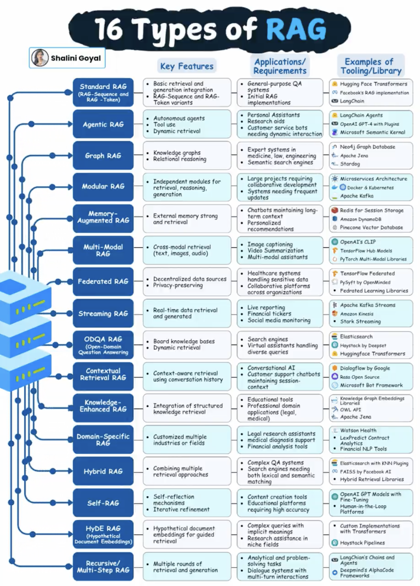
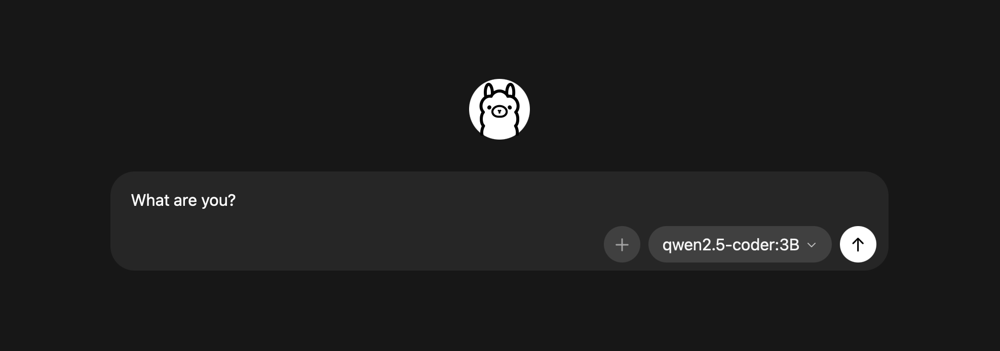

<br/>
<br/>
<div class="message-box">
	<p><em>Disclaimer: I am not an "AI Engineer" or whatever that means. This post describes my thoughts and reflections on the current landscape at this current point in time, and may very well change in the future.</em></p>
</div>
<br>


<p align="center"><em>RAG</em></p>

I was scrolling **X** one day and saw this [post](https://x.com/goyalshaliniuk/status/2019735325321388416?s=20) about RAG. I thought _"Whoa! The AI landscape has evolved so much!"_. So I started going down the rabbit hole, trying to understand what RAG is.

<div class="message-box">
	<p><em>Retrieval-augmented generation (RAG) is a technique that enhances large language models (LLMs) by allowing them to retrieve and incorporate new information from external data sources before generating responses. This approach improves the accuracy and relevance of the information provided by the LLMs.<br>- Wikipedia</em></p>
</div>

So apparently this is a **_technique_** used to interface with an LLM? Okay, what exactly is this technique I wondered. So I went to setup my own LLM, and since I have a MacBook, I went with the Ollama setup.


<p align="center"><em>Ollama</em></p>

Looking at the [docs](https://docs.ollama.com/quickstart#curl), Ollama exposes a HTTP endpoint where we can send HTTP request to interface with the model.

```bash
curl http://localhost:11434/api/chat -d '{
  "model": "qwen2.5-coder:3B",
  "messages": [{
    "role": "user",
    "content": "What are you?"
  }],
  "stream": false
}'
```

There is this concept of Tools as well, which we can prompt the LLM to use.

```bash
curl http://localhost:11434/api/chat -d '{
  "model": "qwen2.5-coder:3B",
  "messages": [{
    "role": "user",
    "content": "What are you?"
  }],
  "stream": false,
  "tools": [
    "type": "function",
    "function": {
      "name": "ask_god",
      "description": "Prays to God for an answer.",
      "parameters": {
        "type": "object",
        "required": ["god_name"],
        "properties": {
          "god_name": {
            "type": "string",
            "description": "The name of the God you wish to pray to."
          }
        },
      },
    }
  ]
}'
```

If the LLM does not know the answer, the response will request the use of Tools available. The engineer will then have to write code to call the specific tool and pipe the response back to the LLM. An example is shown below.

```json
// Initial Response
{
  "model": "qwen2.5-coder:3B",
  "message": {
    "role": "assistant",
    "content": "{\"name\": \"ask_god Prays to God for an answer.\", \"arguments\": {\"god_name\": \"Some God\"}}"
  },
  //...
}
// Reply with Tool answer
{
  //...
  {"role": "tool", "tool_name": "ask_god", "content": "I am GOD!"}
}
```

So apparently this **_technique_** is just a mechanism for piping _JSON_ object messages back-and-forth between an engineer's code and the LLM. Why is there a need to create so many complicated fancy names for this back-and-forth messaging?

## Engineers VS Scientists

From an engineer's point-of-view, we only care about improving production metrics.

When developing a feature, the first question we ask ourselves is that is it working or is it correct. When relying on an LLM system, the correctness largely depends on the LLM component as it is probabilistic in nature. It is not the job of an engineer to solve accuracy issues but that of a data scientist. But hey, RAG exists so that engineers can direct the LLM to find a correct answer right? NO! I strongly believe that is the wrong thought process to have as one would end up over-engineering a solution to the problem. If one cares about complete correctness, an engineer should not rely on a probabilistic engine but code out the exact requirements needed for the problem.

Okay so we accept that it may not be accurate but it can still provide good summaries of information and possibly be a good assistant. Using ChatGPT, DeepSeek, Grok, etc. is great for querying or generating information and content. So why do we not just embed these models into our applications? The answer is cost; it is expensive to host and maintain such a large model while scaling it to many clients.

<div class="message-box">
	<p><em>The value comes from choosing a small model to keep cost low, and making it work for a particular business use-case; possibly using RAG.</em></p>
</div>

The engineer can monitor the number of tokens consumed by the model, along with the end-to-end latency of request(s), when attempting to _"solve"_ a business problem. The results can be benchmarked with the latest state-of-the-art models in terms of accuracy, with the goal of reducing the metrics mentioned above as much as possible to keep cost low.

My future posts will dive deeper into such problems, and attempt to define what an _"AI Engineer"_ actually is.

<div class="message-box">
	<p><em>Fun Fact: The So-So-Ah-So post tag is just to state that the current post is a reflection post. So-So-Ah-So is a Singapore singlish way of talking, whereby our sentences continuously have the word "so" to prove a point.</em></p>
</div>
<br>

<style></style>